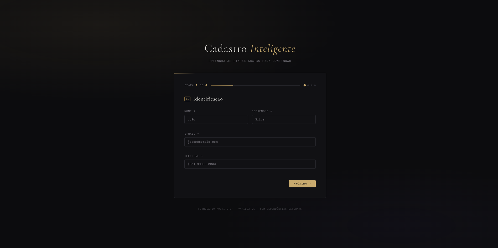

<div align="center">
  <h1>✨ Cadastro Inteligente — Formulário Multi-Step</h1>
  <p>
    Um formulário em múltiplas etapas moderno, dinâmico e focado na experiência do usuário e acessibilidade. 
    Desenvolvido 100% com Vanilla JavaScript, sem dependências externas.
  </p>

  

  <!-- Badges -->
  <a href="https://developer.mozilla.org/pt-BR/docs/Web/JavaScript">
    
  </a>
  <a href="https://developer.mozilla.org/pt-BR/docs/Web/HTML">
    
  </a>
  <a href="https://developer.mozilla.org/pt-BR/docs/Web/CSS">
    
  </a>
</div>

<br>

## 🚀 Sobre o Projeto

O **Cadastro Inteligente** é um projeto desenvolvido para demonstrar a criação de fluxos complexos na web utilizando apenas as tecnologias base da internet. A arquitetura foi pensada para ser modular, escalável e acessível. Este projeto comprova que é possível criar interfaces sofisticadas, animações fluídas e validações robustas sem depender de frameworks ou bibliotecas pesadas.

Ideal para captação de leads, funis de vendas ou qualquer cenário que exija conversão otimizada através da fragmentação cognitiva (dividir um formulário longo em partes menores).

## 🎯 Principais Funcionalidades

- **Navegação Multi-Step Dinâmica**: O usuário avança por 4 etapas (Identificação, Endereço, Preferências, Revisão), o que reduz a taxa de abandono (churn) no preenchimento.
- **Validação de Dados Customizada**: Motor de validação de formulários próprio em Vanilla JS (campos obrigatórios, e-mail, telefone, CEP, etc).
- **Máscaras de Input em Tempo Real**: Formatação automática para campos como Telefone e CEP sem bibliotecas de terceiros.
- **Acessibilidade (A11y)**: O projeto faz uso de tags semânticas, atributos `aria-*` (como `aria-live`, `aria-hidden`) e controle de foco, garantindo usabilidade por leitores de tela e navegação por teclado.
- **UI/UX Premium**: Sistema de design moderno com "Glassmorphism", tipografia elegante (Google Fonts) e feedbacks visuais precisos. O estado de carregamento de progresso orienta o usuário de forma intuitiva.
- **Resumo e Submissão**: Na finalização, o formulário compila as respostas em um resumo dinâmico confirmando o envio bem-sucedido.

## 🛠️ Tecnologias Utilizadas

- **HTML5**: Semântico e estruturado.
- **CSS3**: Layouts flexíveis (Flexbox/Grid), variáveis para customização de temas e animações suaves de transição entre blocos.
- **JavaScript (ES6+)**: 
  - `app.js`: Orquestração global e inicialização.
  - `modulo.js`: Controle de etapas e progresso.
  - `mask.js`: Lógica de injeção de máscaras.
  - `validators.js`: Regras de negócio e validação por campo.

## 📁 Estrutura do Projeto

```text
📦 formulario-multistep
 ┣ 📂 js
 ┃ ┣ 📜 app.js           # Ponto de entrada e binds
 ┃ ┣ 📜 mask.js          # Utilitários de mascara de input
 ┃ ┣ 📜 validators.js    # Regras e validações de dados
 ┃ ┗ 📜 wizard.js        # Lógica de controle dos steps
 ┣ 📜 index.html         # Estrutura e semântica do formulário
 ┣ 📜 styles.css         # Reset, variáveis e estilização dos componentes
 ┗ 📜 README.md          # Documentação do projeto
```

## 🏁 Como Executar

Por ser um projeto puramente estático de Front-end (Vanilla), a execução é extremamente simples. 

1. Clone o repositório ou faça o download:
```bash
git clone https://github.com/SEU_USUARIO/formulario-multistep.git
```
2. Acesse a pasta do projeto:
```bash
cd formulario-multistep
```
3. Abra o arquivo `index.html` em qualquer navegador moderno. 
   - _Opcional:_ Utilize uma extensão como o [Live Server](https://marketplace.visualstudio.com/items?itemName=ritwickdey.LiveServer) do VSCode para recarregamento em tempo real.

## 💼 Perfil Profissional

Este projeto é um excelente reflexo do meu domínio sobre o ecossistema Web Core. A habilidade de construir componentes escaláveis e performáticos sem frameworks demonstra uma base sólida de engenharia de software no Front-end, focado na verdadeira resolução de problemas e entrega de valor para o usuário final.

---

<div align="center">
  Desenvolvido por <a href="https://github.com/carimbamba">Vinícius</a>.
</div>
